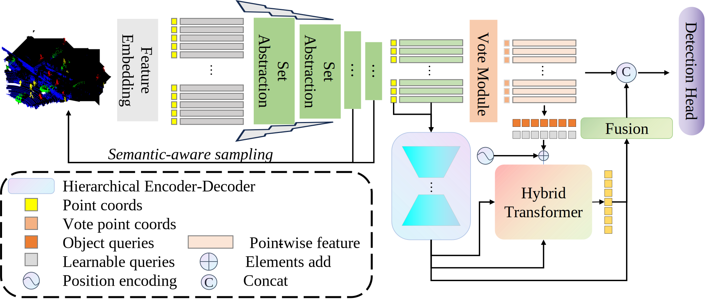
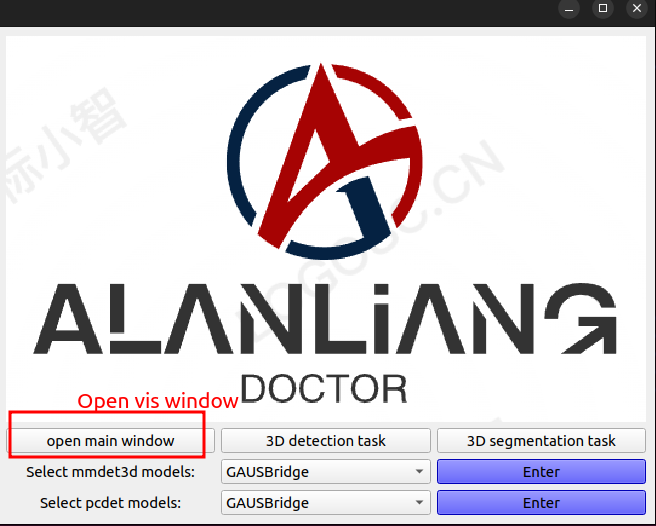
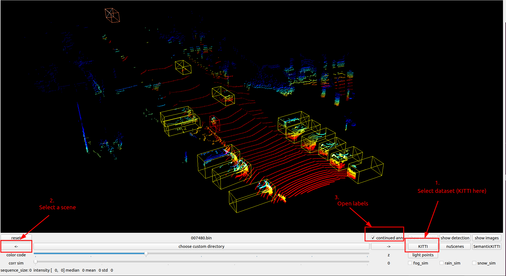
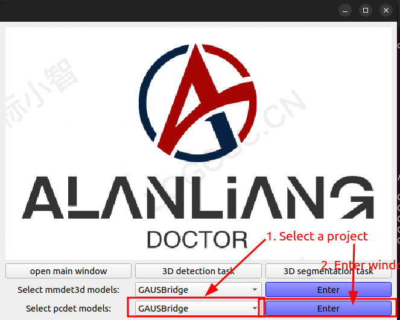
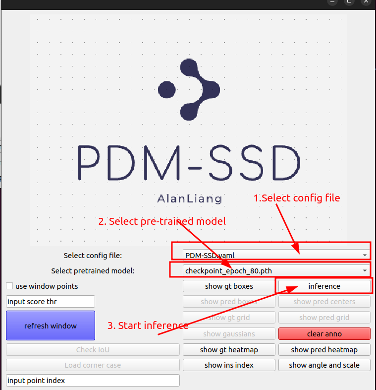
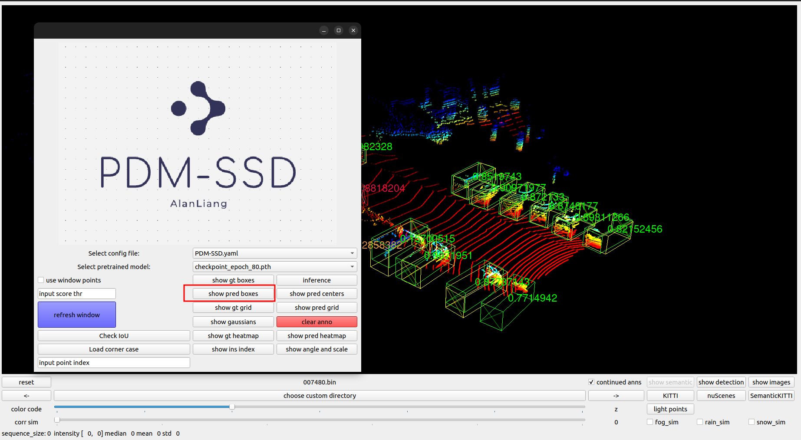
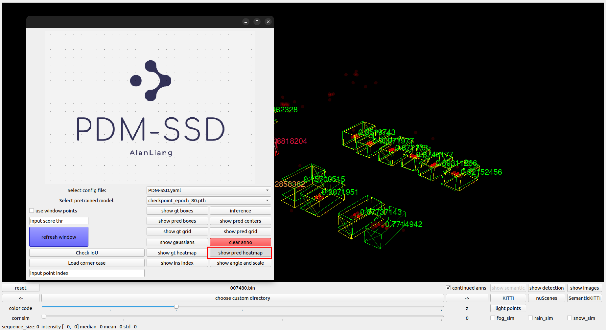
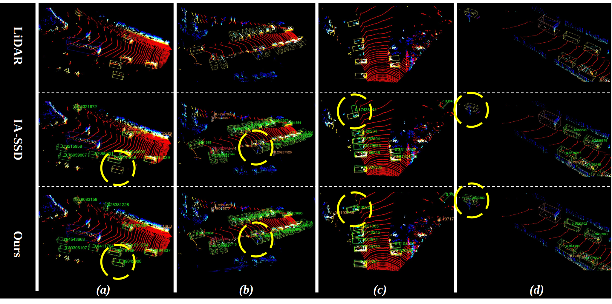

# Boosting 3D Point-based Object Detection by Reducing Information Loss Caused by Discontinuous Receptive Field

This repository is the code release of the paper *Boosting 3D Point-based Object Detection by Reducing Information Loss Caused by Discontinuous Receptive Fields*.

## Introduction

we propose a new end-to-end single-stage point-based model, DRF-SSD, in this pape.

<p align="center">
  
</p>

**Abstract.** The point-based 3D object detection method is highly advantageous due to its lightweight nature and fast inference speed, making it a valuable asset in engineering fields such as intelligent transportation and autonomous driving. However, current advanced methods solely focus on learning features from the provided point cloud, neglecting the active role of unoccupied space. This results in the problem of discontinuous receptive field (DRF), leading to the loss of semantic and geometric information of the objects. To address this issue, we propose a new end-to-end single-stage point-based model, DRF-SSD,  in this paper. DRF-SSD utilizes a PointNet++-style 3D backbone to maintain fast inference capability. Then, point-wise features are projected onto a plane in the Neck structure, and local and global information are aggregated through the designed Hierarchical Encoding-Decoding (HED) and Hybrid Transformer (HT) modules. The former fills in features for unoccupied space through convolutional layers, enhancing local features by interacting with features in occupied space during the learning process. The latter further expands the receptive field using the global learning ability of transformers. The spatial transformation and learning processes in HED and HT only involve key points, and HED is designed to have a special structure that maintains the sparsity of feature maps, preserving the efficiency of the model's inference. Finally, query features are back-projected onto points for feature enhancement and input into the detection head for prediction. Extensive experiments on the KITTI datasets demonstrate that DRF-SSD achieves superior detection accuracy compared to previous methods, with significant improvements. Specifically, the approach obtains 2.25\%, 0.66\%, and 0.42\% improvement for the metric of 3D Average Precision ($AP_{3D}$) under the easy, moderate, and hard settings, respectively. Additionally, the method enables other point-based detectors to achieve substantial gains, demonstrating its effectiveness. Our code will be made available at [github](https://github.com/AlanLiangC/DRF-SSD.git).


## Getting Started

### Requirements
* Linux
* Python >= 3.6
* PyTorch >= 1.3
* CUDA >= 9.0
* CMake >= 3.13.2

### Installation
a. Clone this repository.
```shell
git clone https://github.com/AlanLiangC/PDM-SSD.git
cd PDM-SSD
```

b. Install `pcdet` toolbox.
```shell
pip install -r requirements.txt
python setup.py develop
```

### Data Preparation
a. Prepare datasets.
```
SASA
├── data
│   ├── kitti
│   │   ├── ImageSets
│   │   ├── training
│   │   │   ├──calib & velodyne & label_2 & image_2 & (optional: planes)
│   │   ├── testing
│   │   ├── calib & velodyne & image_2
├── pcdet
├── tools
```

b. Generate data infos.
```shell
# KITTI dataset
python -m pcdet.datasets.kitti.kitti_dataset create_kitti_infos tools/cfgs/dataset_configs/kitti_dataset.yaml
```

### Training
* Train with a single GPU:
```shell script
python train.py --cfg_file ${CONFIG_FILE}
```

* Train with multiple GPUs:
```shell script
sh scripts/dist_train.sh ${NUM_GPUS} --cfg_file ${CONFIG_FILE}
```

### Testing
* Test a pretrained model with a single GPU:
```shell script
python test.py --cfg_file ${CONFIG_FILE} --ckpt ${CKPT}
```

Please check [GETTING_STARTED.md](docs/GETTING_STARTED.md) to learn more usage of `OpenPCDet`.


## Acknowledgement
This project is built with `OpenPCDet` (version `0.6`), a powerful toolbox for LiDAR-based 3D object detection. Please refer to [OpenPCDet.md](OpenPCDet.md) and the [official github repository](https://github.com/open-mmlab/OpenPCDet) for more information.


## License
This project is released under the [Apache 2.0 license](LICENSE).

## Visualization

We have developed a visualization package for the openpcd project, which includes a visualization plugin for PDM-SSD, allowing readers to visually see the advantages of our method.

### Getting Start

#### Setup

1. Install all necessary packages.

```
conda install matplotlib numpy opencv pandas plyfile pyopengl pyqt pyqtgraph quaternion scipy tqdm -c conda-forge -y
pip install pyquaternion
```

2. Clone this repository (including submodules).

```
git clone https://github.com/AlanLiangC/ALViewer.git
```

#### Usage

1. Open main interface.

```
python ALViewer.py
```


<p align="center">
  
</p>


2. Open the radar visualization window `open main windoe`.
3. Choose dataset, select scenario, and open annotation.


<p align="center">
  
</p>


4. Select projects and models that support the latest versions of the mmdet (>=2.0) and openpcd (0.6) projects.


<p align="center">
  
</p>

5. Open the project window, select the configuration file, choose the pre-trained model, and then perform inference.

<p align="center">
  
</p>

6. All functional buttons are located within the project sub-window, for details please refer to the paper.

For example:

- Visual detection results.

<p align="center">
  
</p>

- Heatmap of visualized predictions.

<p align="center">
  
</p>

All the results figures in the paper can be obtained with this plugin. Like:

- detect results

<p align="center">
  
</p>

<p align="center">
  
</p>
